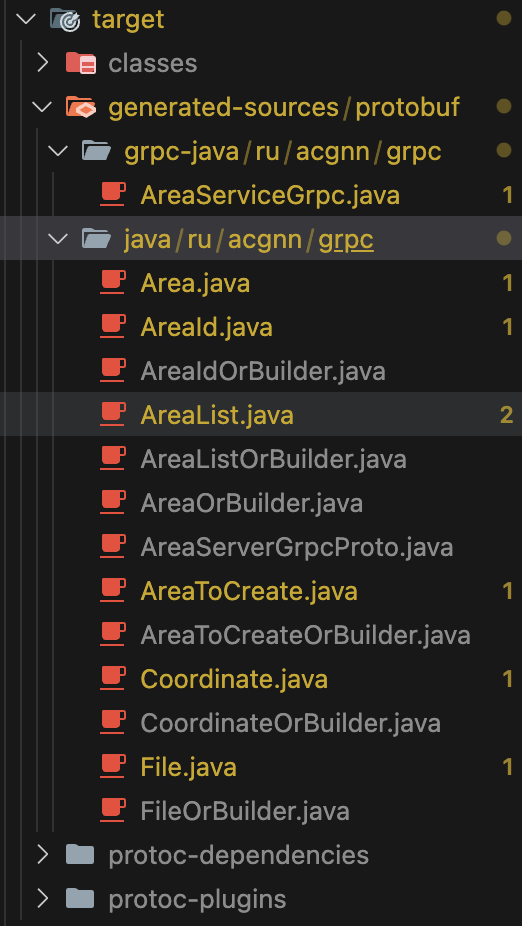

# Реализация OAuth 2.0 на gRPC с помощью Java и Spring Boot
В мире микросервисов безопасность и эффективная коммуникация между сервисами - не просто тренд, а необходимость. OAuth 2.0 стал стандартом авторизации в современных приложениях, а gRPC - один из вариантов быстрой и эффективной передачи данных. Как же на деле объединить эти технологии? Статья посвящена реализации OAuth 2.0 авторизации в gRPC с помощью Java 17 и Spring Boot, и подходит для тех, кто начинает своё знакомство с gRPC.

> Если Вас интересует лишь техническая часть, то можете смело перейти к просмотру реализации демонстрационного проекта.

## Немного теории
### Что такое gRPC?
gRPC (Google Remote Procedure Calls) - это современная и высокопроизводительная система вызова удалённой процедуры (RPC) с открытом исходным кодом, разработанная IT-гигантом Google. Данное решение позволяет эффективно передавать данные между сервисами, используя протокол HTTP/2, а для опеределения процедуры используется Protocol Buffers. Технология поддерживается многими языками, такими как Java, C++, Python и другие. Более подробно можете узнать в [оффициальной документации gRPC](https://grpc.io/docs/).

### Что такое OAuth 2.0?
Простыми словами, OAuth 2.0 - протокол авторизации, позволяющий выдать одному сервису права на доступ к ресурсам пользователя в другом сервисе. Более подробную информацию можете узнать на просторах интернета. Статей на тему OAuth 2.0 достаточно много, и нет особого смысла заострять внимание на всеми разобранный материал.

## Почему их сложно совместить?
OAuth 2.0 и gRPC "не дружат" из под коробки в Spring Framework, для их совместимости необходимо будет немножно покапаться в конфигурациях. Сложнее всего реализовать авторизацию для нескольких клиентов, в случаях, когда один для пользвателей, а другой - для администраторов. Необходимо правильно настроить конвертор для JWT токенов, чтобы корректно отбирать роли.

## Техническая часть
Приступим к разработке. Проект состоит из микросервисов:

1) grpc-interface
2) area-server
3) area-client

Рассмотрим только grpc-interface и area-server в рамках текущий статьи. В качестве сервера авторизации используется [Keycloak](https://www.keycloak.org/). Микросервисы area-client и area-server будут коммуницировать с помощью gRPC, в Metadata запроса будет добавляться заголовок Authorization c Bearer-токеном, который будет валидироваться сервером авторизации. Реализация будет на Spring Boot, Java 17. Сборщик проекта будет Maven.

### grpc-interface

Для начала опеределим area.proto файл и опишим процедуры.
```
syntax = "proto3";

import "google/protobuf/timestamp.proto";
import "google/protobuf/empty.proto";

package ru.acgnn.grpc.area;

option java_multiple_files = true;
option java_package = "ru.acgnn.grpc";
option java_outer_classname = "AreaServerGrpcProto";

service AreaService {
    rpc GetAreas (google.protobuf.Empty) returns (AreaList) {};
    rpc GetAreaById (AreaId) returns (Area) {};
    rpc CreateArea (AreaToCreate) returns (AreaId) {};
    rpc SaveFile (File) returns (google.protobuf.Empty) {};
    rpc StreamingFile (stream File) returns (google.protobuf.Empty) {};
}

message AreaId {
    string id = 1;
}

message AreaList {
    repeated Area areas = 1;
}

message Coordinate {
    double longitude = 1;
    double latitude = 2;
}

message Area {
    string id = 1;
    string title = 2;
    string description = 3;
    string address = 4;
    google.protobuf.Timestamp creationDateTime = 5;
    google.protobuf.Timestamp updateDateTime = 6;
    Coordinate Coordinate = 7;
}

message AreaToCreate {
    string title = 1;
    string description = 2;
    string address = 3;
    Coordinate Coordinate = 4;
}

message File {
    string content_type = 1;
    bytes content = 2;
}
```


Напишем pom.xml, чтобы проект правильно собирался и скомпилировался.
```
<?xml version="1.0" encoding="UTF-8"?>
<project xmlns="http://maven.apache.org/POM/4.0.0"
         xmlns:xsi="http://www.w3.org/2001/XMLSchema-instance"
         xsi:schemaLocation="http://maven.apache.org/POM/4.0.0 http://maven.apache.org/xsd/maven-4.0.0.xsd">
    <modelVersion>4.0.0</modelVersion>

    <groupId>ru.acgnn.grpc</groupId>
    <artifactId>grpc-interface</artifactId>
    <version>1.0.0</version>

    <properties>
        <java.version>17</java.version>
        <protobuf.version>3.23.4</protobuf.version>
        <protobuf-plugin.version>0.6.1</protobuf-plugin.version>
        <grpc.version>1.58.0</grpc.version>
    </properties>

    <dependencies>
        <dependency>
            <groupId>io.grpc</groupId>
            <artifactId>grpc-stub</artifactId>
            <version>${grpc.version}</version>
        </dependency>

        <dependency>
            <groupId>io.grpc</groupId>
            <artifactId>grpc-protobuf</artifactId>
            <version>${grpc.version}</version>
        </dependency>

        <dependency>
            <!-- Java 9+ compatibility - Do NOT update to 2.0.0 -->
            <groupId>jakarta.annotation</groupId>
            <artifactId>jakarta.annotation-api</artifactId>
            <version>1.3.5</version>
            <optional>true</optional>
        </dependency>
    </dependencies>

    <build>
        <extensions>
            <extension>
                <groupId>kr.motd.maven</groupId>
                <artifactId>os-maven-plugin</artifactId>
                <version>1.7.0</version>
            </extension>
        </extensions>

        <plugins>
            <plugin>
                <groupId>org.xolstice.maven.plugins</groupId>
                <artifactId>protobuf-maven-plugin</artifactId>
                <version>${protobuf-plugin.version}</version>
                <configuration>
                    <protocArtifact>com.google.protobuf:protoc:${protobuf.version}:exe:${os.detected.classifier}</protocArtifact>
                    <pluginId>grpc-java</pluginId>
                    <pluginArtifact>io.grpc:protoc-gen-grpc-java:${grpc.version}:exe:${os.detected.classifier}</pluginArtifact>
                    <protoSourceRoot>${basedir}/src/main/proto/</protoSourceRoot>
                </configuration>
                <executions>
                    <execution>
                        <goals>
                            <goal>compile</goal>
                            <goal>compile-custom</goal>
                        </goals>
                    </execution>
                </executions>
            </plugin>
        </plugins>
    </build>
</project>
```

Структура проекта.


Запустив сборку проекта, появятся скомпилированные Java классы.



### area-server
Добавим следующие зависимости в pom.xml
```
<?xml version="1.0" encoding="UTF-8"?>
<project xmlns="http://maven.apache.org/POM/4.0.0" xmlns:xsi="http://www.w3.org/2001/XMLSchema-instance"
	xsi:schemaLocation="http://maven.apache.org/POM/4.0.0 https://maven.apache.org/xsd/maven-4.0.0.xsd">
	<modelVersion>4.0.0</modelVersion>
	<parent>
		<groupId>org.springframework.boot</groupId>
		<artifactId>spring-boot-starter-parent</artifactId>
		<version>3.3.6</version>
		<relativePath/>
	</parent>
	<groupId>ru.acgnn</groupId>
	<artifactId>area-server</artifactId>
	<version>0.0.1-SNAPSHOT</version>
	<name>area-server</name>
	<description>Area Spring Boot Application</description>
	<properties>
		<java.version>17</java.version>
		<mapstruct.version>1.6.2</mapstruct.version>
		<grpc.version>3.1.0.RELEASE</grpc.version>
		<hibernate.version>6.4.1.FINAL</hibernate.version>
		<spring-cloud.version>2023.0.3</spring-cloud.version>
	</properties>
	<dependencies>
		<dependency>
            <groupId>net.devh</groupId>
            <artifactId>grpc-server-spring-boot-starter</artifactId>
			<version>${grpc.version}</version>
        </dependency>

		<dependency>
			<groupId>org.springframework.boot</groupId>
			<artifactId>spring-boot-starter-data-jpa</artifactId>
		</dependency>

		<dependency>
			<groupId>ru.acgnn.grpc</groupId>
			<artifactId>grpc-interface</artifactId>
			<version>1.0.0</version>
		</dependency>

		<dependency>
			<groupId>org.springframework.boot</groupId>
			<artifactId>spring-boot-starter-oauth2-authorization-server</artifactId>
		</dependency>
		<dependency>
			<groupId>org.springframework.boot</groupId>
			<artifactId>spring-boot-starter-validation</artifactId>
		</dependency>

		<dependency>
			<groupId>org.postgresql</groupId>
			<artifactId>postgresql</artifactId>
			<scope>runtime</scope>
		</dependency>
		<dependency>
			<groupId>org.projectlombok</groupId>
			<artifactId>lombok</artifactId>
			<optional>true</optional>
		</dependency>

		<dependency>
			<groupId>org.hibernate</groupId>
			<artifactId>hibernate-spatial</artifactId>
			<version>${hibernate.version}</version>
		</dependency>

		<dependency>
			<groupId>org.springframework.boot</groupId>
			<artifactId>spring-boot-starter-test</artifactId>
			<scope>test</scope>
		</dependency>

		<dependency>
			<groupId>org.mapstruct</groupId>
			<artifactId>mapstruct</artifactId>
			<version>${mapstruct.version}</version>
		</dependency>

		<dependency>
			<groupId>org.springframework.cloud</groupId>
			<artifactId>spring-cloud-starter-netflix-eureka-client</artifactId>
		</dependency>

		<dependency>
			<groupId>org.mapstruct</groupId>
			<artifactId>mapstruct-processor</artifactId>
			<version>${mapstruct.version}</version>
		</dependency>
	</dependencies>

	<dependencyManagement>
		<dependencies>
			<dependency>
				<groupId>org.springframework.cloud</groupId>
				<artifactId>spring-cloud-dependencies</artifactId>
				<type>pom</type>
				<scope>import</scope>
				<version>${spring-cloud.version}</version>
			</dependency>
		</dependencies>
	</dependencyManagement>

	<build>
		<plugins>
			<plugin>
				<groupId>org.springframework.boot</groupId>
				<artifactId>spring-boot-maven-plugin</artifactId>
				<configuration>
					<excludes>
						<exclude>
							<groupId>org.projectlombok</groupId>
							<artifactId>lombok</artifactId>
						</exclude>
					</excludes>
				</configuration>
			</plugin>
		</plugins>
	</build>

</project>
```

Обратите внимание на следующую зависимость
```
<dependency>
	<groupId>ru.acgnn.grpc</groupId>
	<artifactId>grpc-interface</artifactId>
	<version>1.0.0</version>
</dependency>
```

Она берётся из локального репозитория Maven, куда был отправлен предыдущий микросервис.

Структура будет следующей:


Определим Property-класс в пакете ru.acgnn.area_server.property
```
import java.util.ArrayList;
import java.util.Arrays;
import java.util.List;

import org.springframework.boot.context.properties.ConfigurationProperties;
import org.springframework.core.io.Resource;
import org.springframework.stereotype.Component;

import lombok.Getter;
import lombok.Setter;
import lombok.ToString;

@Getter
@Setter
@ToString
@Component
@ConfigurationProperties(prefix = "spring.security.oauth2.resourceserver")
public class OAuth2ResourceServerProperty {

    List<Issuer> jwt;
    
    @Getter
    @Setter
    @ToString
    public static class Issuer {

        private String jwkSetUri;

		/**
		 * JSON Web Algorithms used for verifying the digital signatures.
		 */
		private List<String> jwsAlgorithms = Arrays.asList("RS256");

		/**
		 * URI that can either be an OpenID Connect discovery endpoint or an OAuth 2.0
		 * Authorization Server Metadata endpoint defined by RFC 8414.
		 */
		private String issuerUri;

		/**
		 * Location of the file containing the public key used to verify a JWT.
		 */
		private Resource publicKeyLocation;

		/**
		 * Identifies the recipients that the JWT is intended for.
		 */
		private List<String> audiences = new ArrayList<>();

		/**
		 * Prefix to use for authorities mapped from JWT.
		 */
		private String authorityPrefix;

		/**
		 * Regex to use for splitting the value of the authorities claim into authorities.
		 */
		private String authoritiesClaimDelimiter;

		/**
		 * Name of token claim to use for mapping authorities from JWT.
		 */
		private String authoritiesClaimName;

		/**
		 * JWT principal claim name.
		 */
		private String principalClaimName;
    }
}
```

Напишим конвертор JWT токенов для корректного отбора ролей в пакете ru.acgnn.area_server.convertor.
```
import java.util.ArrayList;
import java.util.Collection;
import java.util.Map;
import java.util.stream.Collectors;

import org.springframework.core.convert.converter.Converter;
import org.springframework.security.core.GrantedAuthority;
import org.springframework.security.core.authority.SimpleGrantedAuthority;
import org.springframework.security.oauth2.jwt.Jwt;

public class GrantedAuthorityConverter implements Converter<Jwt, Collection<GrantedAuthority>> {

    public static final String PREFIX_REALM_ROLE = "ROLE_realm_";
    public static final String PREFIX_RESOURCE_ROLE = "ROLE_";
    private static final String CLAIM_REALM_ACCESS = "realm_access";
    private static final String CLAIM_RESOURCE_ACCESS = "resource_access";
    private static final String CLAIM_ROLES = "roles";

    public Collection<GrantedAuthority> convert(Jwt jwt) {
      // Collection that will hold the extracted roles
      Collection<GrantedAuthority> grantedAuthorities = new ArrayList<>();
  
      // Realm roles
      // Get the part of the access token that holds the roles assigned on realm level
      Map<String, Collection<String>> realmAccess = jwt.getClaim(CLAIM_REALM_ACCESS);
  
      // Verify that the claim exists and is not empty
      if (realmAccess != null && !realmAccess.isEmpty()) {
        // From the realm_access claim get the roles
        Collection<String> roles = realmAccess.get(CLAIM_ROLES);
        // Check if any roles are present
        if (roles != null && !roles.isEmpty()) {
          // Iterate of the roles and add them to the granted authorities
          Collection<GrantedAuthority> realmRoles = roles.stream()
                  // Prefix all realm roles with "ROLE_realm_"
                  .map(role -> new SimpleGrantedAuthority(PREFIX_REALM_ROLE + role))
                  .collect(Collectors.toList());
          grantedAuthorities.addAll(realmRoles);
        }
      }
  
      // Resource (client) roles
      // A user might have access to multiple resources all containing their own roles. Therefore, it is a map of
      // resource each possibly containing a "roles" property.
      Map<String, Map<String, Collection<String>>> resourceAccess = jwt.getClaim(CLAIM_RESOURCE_ACCESS);
  
      // Check if resources are assigned
      if (resourceAccess != null && !resourceAccess.isEmpty()) {
        // Iterate of all the resources
        resourceAccess.forEach((resource, resourceClaims) -> {
          // Iterate of the "roles" claim inside the resource claims
          resourceClaims.get(CLAIM_ROLES).forEach(
                  // Add the role to the granted authority prefixed with ROLE_ and the name of the resource
                  role -> grantedAuthorities.add(new SimpleGrantedAuthority(PREFIX_RESOURCE_ROLE + role))
          );
        });
      }
      return grantedAuthorities;
    }
}
```

Теперь можем перейти к конфигурации SpringSecurity в пакете ru.acgnn.area_server.configuration.
```
import java.util.Map;
import java.util.stream.Collectors;

import org.springframework.context.annotation.Bean;
import org.springframework.context.annotation.Configuration;
import org.springframework.security.authentication.AuthenticationManager;
import org.springframework.security.authentication.ProviderManager;
import org.springframework.security.config.annotation.method.configuration.EnableMethodSecurity;
import org.springframework.security.config.annotation.web.builders.HttpSecurity;
import org.springframework.security.config.annotation.web.configuration.EnableWebSecurity;
import org.springframework.security.config.annotation.web.configurers.AbstractHttpConfigurer;
import org.springframework.security.config.http.SessionCreationPolicy;
import org.springframework.security.oauth2.jwt.JwtDecoder;
import org.springframework.security.oauth2.jwt.JwtDecoders;
import org.springframework.security.oauth2.server.resource.authentication.BearerTokenAuthenticationToken;
import org.springframework.security.oauth2.server.resource.authentication.JwtAuthenticationConverter;
import org.springframework.security.oauth2.server.resource.authentication.JwtAuthenticationProvider;
import org.springframework.security.oauth2.server.resource.authentication.JwtIssuerAuthenticationManagerResolver;
import org.springframework.security.web.SecurityFilterChain;
import org.springframework.web.cors.CorsConfiguration;
import org.springframework.web.cors.UrlBasedCorsConfigurationSource;
import org.springframework.web.filter.CorsFilter;

import lombok.RequiredArgsConstructor;
import net.devh.boot.grpc.server.security.authentication.BearerAuthenticationReader;
import ru.acgnn.area_server.converter.GrantedAuthorityConverter;
import ru.acgnn.area_server.property.OAuth2ResourceServerProperty;
import ru.acgnn.area_server.property.OAuth2ResourceServerProperty.Issuer;

@Configuration
@EnableWebSecurity
@RequiredArgsConstructor
@EnableMethodSecurity
public class SecurityConfig {

    private final OAuth2ResourceServerProperty resourceServerProperty;

    @Bean
    CorsFilter corsFilter() {
        CorsConfiguration config = new CorsConfiguration();
        config.addAllowedOrigin("*");
        config.addAllowedMethod("*");
        config.addAllowedHeader("*");
        config.setAllowCredentials(true);

        UrlBasedCorsConfigurationSource source = new UrlBasedCorsConfigurationSource();
        source.registerCorsConfiguration("/**", config);
        return new CorsFilter(source);
    }

    @Bean
    SecurityFilterChain filterChain(HttpSecurity http) throws Exception {
        return http
            .csrf(AbstractHttpConfigurer::disable)
            .cors(AbstractHttpConfigurer::disable)
            .authorizeHttpRequests(authz -> authz.anyRequest().permitAll())
            .sessionManagement(sessionManagment -> sessionManagment.sessionCreationPolicy(SessionCreationPolicy.STATELESS))
            .oauth2ResourceServer(oauth2 -> oauth2.authenticationManagerResolver(jwtIssuerAuthenticationManagerResolver()))
            .build();
    }

    @Bean
    JwtIssuerAuthenticationManagerResolver jwtIssuerAuthenticationManagerResolver() {
        Map<String, AuthenticationManager> authenticationManagers = resourceServerProperty.getJwt().stream()
            .collect(Collectors.toMap(
                issuer -> issuer.getIssuerUri(),
                issuer -> jwtAuthProvider(issuer)::authenticate
            ));
        return new JwtIssuerAuthenticationManagerResolver(authenticationManagers::get);
    }

    @Bean
    AuthenticationManager authManager() {
        return new ProviderManager(resourceServerProperty.getJwt().stream().map(this::jwtAuthProvider).collect(Collectors.toList()));
    }

    @Bean
    BearerAuthenticationReader authReader() {
        return new BearerAuthenticationReader(accessToken -> new BearerTokenAuthenticationToken(accessToken));
    }

    private JwtDecoder jwtDecoderByIssuerUri(String issuerUri) {
        return JwtDecoders.fromIssuerLocation(issuerUri);
    }

    private JwtAuthenticationProvider jwtAuthProvider(Issuer issuer) {
        JwtAuthenticationProvider authenticationProvider = new JwtAuthenticationProvider(jwtDecoderByIssuerUri(issuer.getIssuerUri()));
        JwtAuthenticationConverter jwtAuthenticationConverter = new JwtAuthenticationConverter();
        jwtAuthenticationConverter.setJwtGrantedAuthoritiesConverter(new GrantedAuthorityConverter());
        authenticationProvider.setJwtAuthenticationConverter(jwtAuthenticationConverter);
        return authenticationProvider;
    }
}
```

Зависимость grpc-spring-boot-starter поддерживает spring-security изначально, поэтому можно просто использовать известные аннотации для защиты своего приложения. Объявляется Bean AuthenticationManager, чтобы в зависимости от эмитента токена корректно выполнялась валидация токена, конвертор ролей для всех одинаковый. Благодаря конфигурации выше, OAuth 2.0 объявлен на уровне Rest API методов и gRPC. Дальше необходимо, чтобы на уровне gRPC можно было извлекать аутентификацию пользователя из SpringSecurityContext, для этого объявим 2 interceptor-класса, один из для логгирования запросов, другой - для добавлена аутентификации пользователя в SpringSecurityContext. 

SecurityInterceptor в пакете ru.acgnn.area_server.interceptor.grpc:
```
import org.springframework.core.annotation.Order;
import org.springframework.security.authentication.AuthenticationManager;
import org.springframework.security.core.Authentication;
import org.springframework.security.core.context.SecurityContextHolder;

import io.grpc.Metadata;
import io.grpc.ServerCall;
import io.grpc.ServerCall.Listener;
import io.grpc.ServerCallHandler;
import io.grpc.ServerInterceptor;
import lombok.RequiredArgsConstructor;
import net.devh.boot.grpc.server.interceptor.GrpcGlobalServerInterceptor;
import net.devh.boot.grpc.server.security.authentication.BearerAuthenticationReader;

@Order(1)
@RequiredArgsConstructor
@GrpcGlobalServerInterceptor
public class SecurityInterceptor implements ServerInterceptor {

    private final AuthenticationManager authManager;
    private final BearerAuthenticationReader authReader;

    @Override
    public <ReqT, RespT> Listener<ReqT> interceptCall(
        ServerCall<ReqT, RespT> call, 
        Metadata headers, 
        ServerCallHandler<ReqT, RespT> next
    ) {
        Authentication auth = authReader.readAuthentication(call, headers);
        SecurityContextHolder.getContext().setAuthentication(auth != null ? authManager.authenticate(auth) : auth);
        return next.startCall(call, headers);
    }

}
```

LogInterceptor в пакете ru.acgnn.area_server.interceptor.grpc:
```
import org.springframework.core.annotation.Order;

import io.grpc.Metadata;
import io.grpc.ServerCall;
import io.grpc.ServerCall.Listener;
import io.grpc.ServerCallHandler;
import io.grpc.ServerInterceptor;
import lombok.extern.slf4j.Slf4j;
import net.devh.boot.grpc.server.interceptor.GrpcGlobalServerInterceptor;

@Slf4j
@Order(2)
@GrpcGlobalServerInterceptor
public class LogInterceptor implements ServerInterceptor {
    
    @Override
    public <ReqT, RespT> Listener<ReqT> interceptCall(
        ServerCall<ReqT, RespT> call, 
        Metadata headers,
        ServerCallHandler<ReqT, RespT> next
    ) {
        log.debug("{}", call.getMethodDescriptor().getFullMethodName()); 
        return next.startCall(call, headers);
    }

}
```

После этого возникает возможность внутри сервисов извлекать аутентификацию пользователя, обращаясь к SpringSecurityContextHolder
```
public AreaEntity getById(UUID id) {
    JwtAuthenticationToken auth = (JwtAuthenticationToken) SecurityContextHolder.getContext().getAuthentication();
    return areaRepo.findById(id)
        .orElseThrow(() -> new ApiServiceException("Площадка не найдена", HttpStatus.NOT_FOUND));
}
```

gRPC "контроллеры" выглядят следующим образом:
```
import java.util.UUID;

import org.springframework.security.access.prepost.PreAuthorize;

import com.google.protobuf.Empty;

import io.grpc.stub.StreamObserver;
import lombok.RequiredArgsConstructor;
import net.devh.boot.grpc.server.service.GrpcService;
import ru.acgnn.area_server.mapper.AreaMapper;
import ru.acgnn.area_server.service.AreaService;
import ru.acgnn.area_server.service.FileService;
import ru.acgnn.grpc.Area;
import ru.acgnn.grpc.AreaId;
import ru.acgnn.grpc.AreaList;
import ru.acgnn.grpc.AreaServiceGrpc.AreaServiceImplBase;
import ru.acgnn.grpc.AreaToCreate;
import ru.acgnn.grpc.File;

@GrpcService
@RequiredArgsConstructor
@PreAuthorize("hasRole('admin')")
public class AreaGrpc extends AreaServiceImplBase {

    private final AreaService areaService;
    private final FileService fileService;
    private final AreaMapper areaMapper;

    @Override
    public void getAreaById(AreaId request, StreamObserver<Area> responseObserver) {
        responseObserver.onNext(areaMapper.toDto(areaService.getById(UUID.fromString(request.getId()))));
        responseObserver.onCompleted();
    }

    @Override
    public void getAreas(Empty request, StreamObserver<AreaList> responseObserver) {
        responseObserver.onNext(AreaList.newBuilder().addAllAreas(areaMapper.toListDto(areaService.getAll())).build());
        responseObserver.onCompleted();
    }

    @Override
    public void createArea(AreaToCreate request, StreamObserver<AreaId> responseObserver) {
        responseObserver.onNext(
            AreaId.newBuilder()
                .setId(areaService.createArea(areaMapper.toEntity(request)).getId().toString())
                .build()
        );
        responseObserver.onCompleted();
    }
    
    @Override
    public void saveFile(File file, StreamObserver<Empty> responseObserver) {
        fileService.saveFile(file);
        responseObserver.onNext(Empty.newBuilder().build());
        responseObserver.onCompleted();
    }
}
```

Таким образом, мы настроили наш grpc-server с OAuth 2.0 авторизацией на уровне gRPC, отправляя аутентификацию пользователей в SpringSecurityContext в interceptor-классах, чтобы потом обращаться к данной аутентификации внутри сервисов через SpringSecurityContextHolder.
