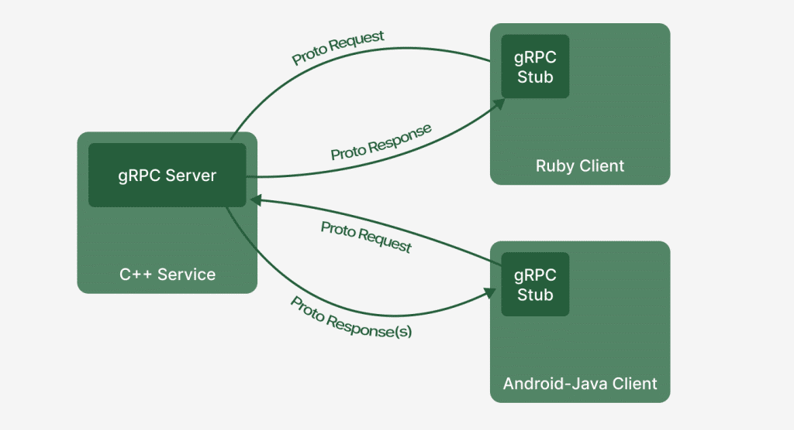

# Реализация gRPC с помощью Java и Spring Boot
В мире микросервисов зачастую возникает нужда в быстром общении между сервисами, как альтренатива Rest API к нам на помощь приходит gRPC. Статья будет посвящена реализации gRPC с помощью Spring Boot и Java 17, и будет полезна тем, кто начинает своё знакомство с gRPC.

## Немного теории

### Что такое gRPC?
gRPC (Google Remote Procedure Calls) - это современная и высокопроизводительная система вызова удалённой процедуры (RPC) с открытом исходным кодом, разработанная IT-гигантом Google. Данное решение позволяет эффективно передавать данные между сервисами, используя протокол HTTP/2, а для опеределения процедуры используется Protocol Buffers. Технология поддерживается многими языками, такими как Java, C++, Python и другие. Более подробно можете узнать в [оффициальной документации gRPC](https://grpc.io/docs/).

## Преимущества

1) Высокая производительность – Благодаря использованию HTTP/2 и protobuf, gRPC обеспечивает минимальные задержки и высокую пропускную способность.

2) Четкая контрактность – Применение protobuf для описания сервисов и сообщений позволяет строго задавать структуру данных, что уменьшает вероятность ошибок на этапе компиляции.

3) Мультиплатформенность – Поддержка множества языков программирования позволяет объединять компоненты, написанные на разных технологиях, в единую систему, упрощая интеграцию и переиспользование кода.

4) Двунаправленный стриминг – gRPC поддерживает не только запрос-ответ, но и двусторонние потоки, а также полный дуплекс, что делает его отличным выбором для работы с данными в реальном времени, например, в чатах или системах мониторинга.

5) Автоматическая генерация кода – gRPC автоматически создает клиентские и серверные заглушки (stubs), избавляя разработчиков от написания шаблонного кода и снижая вероятность ошибок. Это ускоряет процесс разработки.

## Недостатки

1) Высокий порог входа – Для новичков gRPC может показаться сложным из-за необходимости изучения protobuf и особенностей работы с HTTP/2. Однако с опытом освоение технологии становится проще.

2) Ограниченная поддержка в браузерах – Большинство браузеров не поддерживают gRPC напрямую, что требует использования дополнительных решений, таких как gRPC-Web или прокси-серверы, усложняя разработку веб-приложений.

3) Зависимость от Protocol Buffers – Применение protobuf в качестве основного формата сериализации может быть неудобным для тех, кто привык к JSON или XML. Хотя protobuf более эффективен, он требует дополнительных шагов для преобразования данных.

4) Требования к инфраструктуре – Эффективное использование gRPC возможно только при поддержке HTTP/2 на уровне сетевой инфраструктуры, что может потребовать дополнительных настроек и ресурсов, особенно если существующая система не адаптирована под HTTP/2.

## Работа с Protocol Buffers
ProtoBuf — это язык описания интерфейса и система сериализации данных, разработанные Google. Они используются для сериализации структурированных данных. Структура данных в ProtoBuf описывается в файлах с расширением .proto. Эти файлы содержат определения сообщений (аналогично классам в ООП) и сервисов (опционально). Более подробно можно почитать [здесь](https://protobuf.dev/overview/).

Вот, пример структуры сообщения:
```
message Area {
    string id = 1;
    string title = 2;
    string description = 3;
    string address = 4;
    google.protobuf.Timestamp creationDateTime = 5;
    google.protobuf.Timestamp updateDateTime = 6;
    Coordinate Coordinate = 7;
}
```

Объявление сервиса:
```
service AreaService {
    rpc GetAreas (google.protobuf.Empty) returns (AreaList) {};
    rpc GetAreaById (AreaId) returns (Area) {};
    rpc CreateArea (AreaToCreate) returns (AreaId) {};
    rpc SaveFile (File) returns (google.protobuf.Empty) {};
    rpc StreamingFile (stream File) returns (google.protobuf.Empty) {};
}
```
### Основные типы данных ProtoBuf
int32 (для int) — значение по умолчанию: 0

int64 (для long) — значение по умолчанию: 0

float — значение по умолчанию: 0

double — значение по умолчанию: 0

bool — значение по умолчанию: false

string — значение по умолчанию: пустая строка

byte (для byte[])

repeated (для List/Collection)

map (для Map) — значение по умолчанию: empty map

enum — значение по умолчанию: первое значение в списке значений.

Есть также классы-обёртки, например, как "google/protobuf/timestamp.proto" для даты и времени.

## Перейдём к реализации
