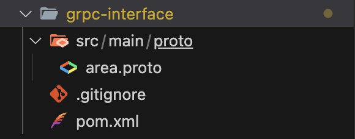
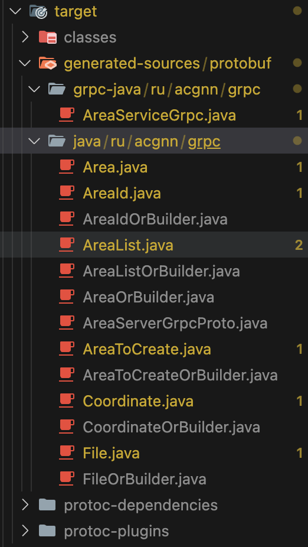

# Реализация gRPC с помощью Java и Spring Boot
В мире микросервисов зачастую возникает нужда в быстром общении между сервисами, как альтренатива Rest API к нам на помощь приходит gRPC. Статья будет посвящена реализации gRPC с помощью Spring Boot и Java 17, и будет полезна тем, кто начинает своё знакомство с gRPC.

## Немного теории

### Что такое gRPC?
gRPC (Google Remote Procedure Calls) - это современная и высокопроизводительная система вызова удалённой процедуры (RPC) с открытом исходным кодом, разработанная IT-гигантом Google. Данное решение позволяет эффективно передавать данные между сервисами, используя протокол HTTP/2, а для опеределения процедуры используется Protocol Buffers. Технология поддерживается многими языками, такими как Java, C++, Python и другие. Более подробно можете узнать в [оффициальной документации gRPC](https://grpc.io/docs/).

## Преимущества

1) Высокая производительность – Благодаря использованию HTTP/2 и protobuf, gRPC обеспечивает минимальные задержки и высокую пропускную способность.

2) Четкая контрактность – Применение protobuf для описания сервисов и сообщений позволяет строго задавать структуру данных, что уменьшает вероятность ошибок на этапе компиляции.

3) Мультиплатформенность – Поддержка множества языков программирования позволяет объединять компоненты, написанные на разных технологиях, в единую систему, упрощая интеграцию и переиспользование кода.

4) Двунаправленный стриминг – gRPC поддерживает не только запрос-ответ, но и двусторонние потоки, а также полный дуплекс, что делает его отличным выбором для работы с данными в реальном времени, например, в чатах или системах мониторинга.

5) Автоматическая генерация кода – gRPC автоматически создает клиентские и серверные заглушки (stubs), избавляя разработчиков от написания шаблонного кода и снижая вероятность ошибок. Это ускоряет процесс разработки.

## Недостатки

1) Высокий порог входа – Для новичков gRPC может показаться сложным из-за необходимости изучения protobuf и особенностей работы с HTTP/2. Однако с опытом освоение технологии становится проще.

2) Ограниченная поддержка в браузерах – Большинство браузеров не поддерживают gRPC напрямую, что требует использования дополнительных решений, таких как gRPC-Web или прокси-серверы, усложняя разработку веб-приложений.

3) Зависимость от Protocol Buffers – Применение protobuf в качестве основного формата сериализации может быть неудобным для тех, кто привык к JSON или XML. Хотя protobuf более эффективен, он требует дополнительных шагов для преобразования данных.

4) Требования к инфраструктуре – Эффективное использование gRPC возможно только при поддержке HTTP/2 на уровне сетевой инфраструктуры, что может потребовать дополнительных настроек и ресурсов, особенно если существующая система не адаптирована под HTTP/2.

## Работа с Protocol Buffers
ProtoBuf — это язык описания интерфейса и система сериализации данных, разработанные Google. Они используются для сериализации структурированных данных. Структура данных в ProtoBuf описывается в файлах с расширением .proto. Эти файлы содержат определения сообщений (аналогично классам в ООП) и сервисов (опционально). Более подробно можно почитать [здесь](https://protobuf.dev/overview/).

Вот, пример структуры сообщения:
```
message Area {
    string id = 1;
    string title = 2;
    string description = 3;
    string address = 4;
    google.protobuf.Timestamp creationDateTime = 5;
    google.protobuf.Timestamp updateDateTime = 6;
    Coordinate Coordinate = 7;
}
```

Объявление сервиса:
```
service AreaService {
    rpc GetAreas (google.protobuf.Empty) returns (AreaList) {};
    rpc GetAreaById (AreaId) returns (Area) {};
    rpc CreateArea (AreaToCreate) returns (AreaId) {};
    rpc SaveFile (File) returns (google.protobuf.Empty) {};
    rpc StreamingFile (stream File) returns (google.protobuf.Empty) {};
}
```
### Основные типы данных ProtoBuf
int32 (для int) — значение по умолчанию: 0

int64 (для long) — значение по умолчанию: 0

float — значение по умолчанию: 0

double — значение по умолчанию: 0

bool — значение по умолчанию: false

string — значение по умолчанию: пустая строка

byte (для byte[])

repeated (для List/Collection)

map (для Map) — значение по умолчанию: empty map

enum — значение по умолчанию: первое значение в списке значений.

Есть также классы-обёртки, например, как "google/protobuf/timestamp.proto" для даты и времени.

## Перейдём к реализации
В рамках статьи разработаем один модуль и два микросевриса. Рекомендуется реализовать проекты с gRPC с разными модулями:
1) gRPC-interface: Содержит файлы формата .proto и генерируется Java классы. 
2) gRPC-server: Содержит реализацию gRPC "эндпоинтов" и gRPC-interface в качестве зависимости через Maven локальный репозиторий.
3) gRPC-client: Любой клиент на Java, который обращается к нашим gRPC "эндпоинтам".

Разделение проекта на модули при разработке с gRPC помогает сделать код более модульным, переиспользуемым и удобным для сопровождения.

### Технологии разработки будут:
1) Spring Boot
2) Spring Cloud
3) gRPC
4) Rest API
5) Swagger 
6) OAuth 2.0
7) MapStruct
8) Spring Data Jpa/Hibernate
9) PostgreSQL

Наш проект будет иметь микросервисную архитектуру.
1) Eureka Server
2) API Gateway
3) grpc-interface
4) area-client
5) area-server

В статье будут рассматриваться grpc-interface, area-client, area-server.

### grpc-interface
Для начала опеределим area.proto файл и опишим процедуры.
```
syntax = "proto3";

import "google/protobuf/timestamp.proto";
import "google/protobuf/empty.proto";

package ru.acgnn.grpc.area;

option java_multiple_files = true;
option java_package = "ru.acgnn.grpc";
option java_outer_classname = "AreaServerGrpcProto";

service AreaService {
    rpc GetAreas (google.protobuf.Empty) returns (AreaList) {};
    rpc GetAreaById (AreaId) returns (Area) {};
    rpc CreateArea (AreaToCreate) returns (AreaId) {};
    rpc SaveFile (File) returns (google.protobuf.Empty) {};
    rpc StreamingFile (stream File) returns (google.protobuf.Empty) {};
}

message AreaId {
    string id = 1;
}

message AreaList {
    repeated Area areas = 1;
}

message Coordinate {
    double longitude = 1;
    double latitude = 2;
}

message Area {
    string id = 1;
    string title = 2;
    string description = 3;
    string address = 4;
    google.protobuf.Timestamp creationDateTime = 5;
    google.protobuf.Timestamp updateDateTime = 6;
    Coordinate Coordinate = 7;
}

message AreaToCreate {
    string title = 1;
    string description = 2;
    string address = 3;
    Coordinate Coordinate = 4;
}

message File {
    string content_type = 1;
    bytes content = 2;
}
```
Блок message отвеает за определение структуры сообщения в rpc эндпоинтах, блок service - за эндпоинты, что они возвращают и принимают на вход.

Напишем pom.xml, чтобы проект правильно собрался и скомпилировался.
Добавляем следующие зависимости:
```
<dependency>
    <groupId>io.grpc</groupId>
    <artifactId>grpc-stub</artifactId>
    <version>${grpc.version}</version>
</dependency>

<dependency>
    <groupId>io.grpc</groupId>
    <artifactId>grpc-protobuf</artifactId>
    <version>${grpc.version}</version>
</dependency>

<dependency>
    <!-- Java 9+ compatibility - Do NOT update to 2.0.0 -->
    <groupId>jakarta.annotation</groupId>
    <artifactId>jakarta.annotation-api</artifactId>
    <version>1.3.5</version>
    <optional>true</optional>
</dependency>
```

Блок build будет выглядить следующим образом:
```
<build>
    <extensions>
        <extension>
            <groupId>kr.motd.maven</groupId>
            <artifactId>os-maven-plugin</artifactId>
            <version>1.7.0</version>
        </extension>
    </extensions>

    <plugins>
        <plugin>
            <groupId>org.xolstice.maven.plugins</groupId>
            <artifactId>protobuf-maven-plugin</artifactId>
            <version>${protobuf-plugin.version}</version>
            <configuration>
                <protocArtifact>com.google.protobuf:protoc:${protobuf.version}:exe:${os.detected.classifier}</protocArtifact>
                <pluginId>grpc-java</pluginId>
                <pluginArtifact>io.grpc:protoc-gen-grpc-java:${grpc.version}:exe:${os.detected.classifier}</pluginArtifact>
                <protoSourceRoot>${basedir}/src/main/proto/</protoSourceRoot>
            </configuration>
            <executions>
                <execution>
                    <goals>
                        <goal>compile</goal>
                        <goal>compile-custom</goal>
                    </goals>
                </execution>
            </executions>
        </plugin>
    </plugins>
</build>
```

Обратите внимание на артефакты, они будут нужны, чтобы добавлять интерфейс в другие проекты, как зависимость. В статье будем рассматривать сборщик Maven.
```
<groupId>ru.acgnn.grpc</groupId>
<artifactId>grpc-interface</artifactId>
<version>1.0.0</version>
```

Структура проекта выглядет так:



Запустив сборку проекта, появятся скомпилированные Java классы.



### area-server
В этом микросервисе напишем небольшую бизнес-логику для grpc эндпоинтов.
Для начала добавим следующие зависимости:
```
<dependency>
	<groupId>org.springframework.boot</groupId>
	<artifactId>spring-boot-starter-data-jpa</artifactId>
</dependency>

<dependency>
	<groupId>ru.acgnn.grpc</groupId>
	<artifactId>grpc-interface</artifactId>
	<version>1.0.0</version>
</dependency>

<dependency>
	<groupId>org.springframework.boot</groupId>
	<artifactId>spring-boot-starter-oauth2-authorization-server</artifactId>
</dependency>

<dependency>
	<groupId>org.springframework.boot</groupId>
	<artifactId>spring-boot-starter-validation</artifactId>
</dependency>

<dependency>
	<groupId>org.postgresql</groupId>
	<artifactId>postgresql</artifactId>
	<scope>runtime</scope>
</dependency>

<dependency>
	<groupId>org.projectlombok</groupId>
	<artifactId>lombok</artifactId>
	<optional>true</optional>
</dependency>

<dependency>
	<groupId>org.hibernate</groupId>
	<artifactId>hibernate-spatial</artifactId>
	<version>${hibernate.version}</version>
</dependency>

<dependency>
	<groupId>org.springframework.boot</groupId>
	<artifactId>spring-boot-starter-test</artifactId>
	<scope>test</scope>
</dependency>

<dependency>
	<groupId>org.mapstruct</groupId>
	<artifactId>mapstruct</artifactId>
	<version>${mapstruct.version}</version>
</dependency>

<dependency>
	<groupId>org.springframework.cloud</groupId>
	<artifactId>spring-cloud-starter-netflix-eureka-client</artifactId>
</dependency>

<dependency>
	<groupId>org.mapstruct</groupId>
	<artifactId>mapstruct-processor</artifactId>
	<version>${mapstruct.version}</version>
</dependency>
```

Дальше приступим за реализацию бизнес-логики. В пакете grpc объявим следующий класс:

```
import java.util.UUID;

import org.springframework.security.access.prepost.PreAuthorize;

import com.google.protobuf.Empty;

import io.grpc.stub.StreamObserver;
import lombok.RequiredArgsConstructor;
import net.devh.boot.grpc.server.service.GrpcService;
import ru.acgnn.area_server.mapper.AreaMapper;
import ru.acgnn.area_server.service.AreaService;
import ru.acgnn.area_server.service.FileService;
import ru.acgnn.grpc.Area;
import ru.acgnn.grpc.AreaId;
import ru.acgnn.grpc.AreaList;
import ru.acgnn.grpc.AreaServiceGrpc.AreaServiceImplBase;
import ru.acgnn.grpc.AreaToCreate;
import ru.acgnn.grpc.File;

@GrpcService
@RequiredArgsConstructor
@PreAuthorize("hasRole('admin')")
public class AreaGrpc extends AreaServiceImplBase {

    private final AreaService areaService;
    private final FileService fileService;
    private final AreaMapper areaMapper;

    @Override
    public void getAreaById(AreaId request, StreamObserver<Area> responseObserver) {
        responseObserver.onNext(areaMapper.toDto(areaService.getById(UUID.fromString(request.getId()))));
        responseObserver.onCompleted();
    }

    @Override
    public void getAreas(Empty request, StreamObserver<AreaList> responseObserver) {
        responseObserver.onNext(AreaList.newBuilder().addAllAreas(areaMapper.toListDto(areaService.getAll())).build());
        responseObserver.onCompleted();
    }

    @Override
    public void createArea(AreaToCreate request, StreamObserver<AreaId> responseObserver) {
        responseObserver.onNext(
            AreaId.newBuilder()
                .setId(areaService.createArea(areaMapper.toEntity(request)).getId().toString())
                .build()
        );
        responseObserver.onCompleted();
    }
    
    @Override
    public void saveFile(File file, StreamObserver<Empty> responseObserver) {
        fileService.saveFile(file);
        responseObserver.onNext(Empty.newBuilder().build());
        responseObserver.onCompleted();
    }
}
```

Здесь расширяемся классом AreaServiceImplBase, который был сгенерирован модулем grpc-interface, и из него делаем импорт нужных нам классов. В проекте соблюдается цепочка: repisotory -> service -> mapper -> controller. То есть на уровне сервиса мы работаем с сущностями и все методы возвращают сущность, а в ответ grpc ручки с помощью маппера конвертируем сущность в нужный dto-класс. 

Сервис у нас будет максимально простым.
```
import java.util.List;
import java.util.UUID;

import org.springframework.http.HttpStatus;
import org.springframework.stereotype.Service;
import org.springframework.transaction.annotation.Transactional;

import lombok.RequiredArgsConstructor;
import lombok.extern.slf4j.Slf4j;
import ru.acgnn.area_server.exception.ApiServiceException;
import ru.acgnn.area_server.model.entity.AreaEntity;
import ru.acgnn.area_server.repository.AreaRepository;

@Slf4j
@Service
@RequiredArgsConstructor
public class AreaService {

    private final AreaRepository areaRepo;

    public AreaEntity getById(UUID id) {
        return areaRepo.findById(id)
            .orElseThrow(() -> new ApiServiceException("Площадка не найдена", HttpStatus.NOT_FOUND));
    }

    @Transactional
    public AreaEntity createArea(AreaEntity area) {
        if (areaRepo.existsByTitleOrCoordinateOrAddress(area.getTitle(), area.getCoordinate(), area.getAddress())) {
            throw new ApiServiceException("Такая площадка уже существует", HttpStatus.CONFLICT);
        }
        return areaRepo.save(area);
    }

    public List<AreaEntity> getAll() {
        return areaRepo.findAll();
    }
}
```

Теперь обратим внимание на Mapper:
```
import java.time.Instant;
import java.time.LocalDateTime;
import java.time.ZoneId;
import java.util.List;

import org.locationtech.jts.geom.GeometryFactory;
import org.locationtech.jts.geom.Point;
import org.locationtech.jts.geom.PrecisionModel;
import org.mapstruct.Mapper;
import org.mapstruct.Mapping;
import org.mapstruct.MappingConstants;
import org.mapstruct.Named;
import org.mapstruct.NullValuePropertyMappingStrategy;

import com.google.protobuf.Timestamp;

import ru.acgnn.grpc.Area;
import ru.acgnn.grpc.AreaToCreate;
import ru.acgnn.grpc.Coordinate;
import ru.acgnn.area_server.model.entity.AreaEntity;

@Mapper(
    componentModel = MappingConstants.ComponentModel.SPRING,
    nullValuePropertyMappingStrategy = NullValuePropertyMappingStrategy.IGNORE
)
public interface AreaMapper {

    @Mapping(source = "area.creationDateTime", target = "creationDateTime", qualifiedByName = "toTimestamp")
    @Mapping(source = "area.updateDateTime", target = "updateDateTime", qualifiedByName = "toTimestamp")
    @Mapping(source = "area.coordinate", target = "coordinate", qualifiedByName = "toCoordinate")
    Area toDto(AreaEntity area);

    @Mapping(source = "area.coordinate", target = "coordinate", qualifiedByName = "toPoint")
    AreaEntity toEntity(AreaToCreate area);

    List<Area> toListDto(List<AreaEntity> areas);

    @Named("toTimestamp")
    default Timestamp toTimestamp(LocalDateTime dateTime) {
        return Timestamp.newBuilder()
            .setSeconds(dateTime.atZone(ZoneId.of("Europe/Moscow")).toEpochSecond())
            .build();
    }

    @Named("toCoordinate")
    default Coordinate toCoordinate(Point coordinate) {
        return Coordinate.newBuilder()
            .setLatitude(coordinate.getY())
            .setLongitude(coordinate.getX())
            .build();
    }

    @Named("toLocalDateTime")
    default LocalDateTime toLocalDateTime(Timestamp timestamp) {
        return Instant
            .ofEpochSecond(timestamp.getSeconds())
            .atZone(ZoneId.of("Europe/Moscow"))
            .toLocalDateTime();
    }

    @Named("toPoint")
    default Point toPoint(Coordinate coordinate) {
        GeometryFactory geometryFactory = new GeometryFactory(new PrecisionModel(), 4326);
        return geometryFactory.createPoint(new org.locationtech.jts.geom.Coordinate(coordinate.getLongitude(), coordinate.getLatitude()));
    }
}
```

Здесь благодаря зависимости mapstruct можно реализовывать маппинг объектов на уровне interface-класса, который поднимается как Сomponent на уровне приложения.
```
import org.springframework.http.HttpStatus;

import lombok.Getter;

@Getter
public class ApiServiceException extends RuntimeException {

    private final HttpStatus status;

    public ApiServiceException(String message, HttpStatus status) {
        super(message);
        this.status = status;
    }
}
```

Мой кастомный-класс ошибки. Теперь возникает вопрос, как настроить Controller Advice так, чтобы он возвращал ошибки с корректными статусами. 
```
import org.springframework.http.HttpStatus;
import org.springframework.security.oauth2.server.resource.InvalidBearerTokenException;

import io.grpc.Status;
import lombok.extern.slf4j.Slf4j;
import net.devh.boot.grpc.server.advice.GrpcAdvice;
import net.devh.boot.grpc.server.advice.GrpcExceptionHandler;
import ru.acgnn.area_server.exception.ApiServiceException;

@Slf4j
@GrpcAdvice
public class GprcHandler {

    @GrpcExceptionHandler(ApiServiceException.class)
    public Status handleInvalidArgument(ApiServiceException e) {
        log.debug("ApiServiceException: {}", e.getMessage());
        return getStatus(e.getStatus()).withDescription(e.getMessage());
    }

    @GrpcExceptionHandler(InvalidBearerTokenException.class)
    public Status handleInvalidBearerTokenException(InvalidBearerTokenException e) {
        log.debug("InvalidBearerTokenException: {}", e.getMessage());
        return Status.UNAUTHENTICATED.withDescription(e.getMessage());
    }

    @GrpcExceptionHandler(IllegalArgumentException.class)
    public Status handleIllegalArgumentException(IllegalArgumentException e) {
        log.debug("IllegalArgumentException: {}", e.getMessage());
        return Status.INVALID_ARGUMENT.withDescription(e.getMessage());
    }

    private Status getStatus(HttpStatus status) {
        return switch (status) {
            case NOT_FOUND -> Status.NOT_FOUND;
            case BAD_REQUEST -> Status.INVALID_ARGUMENT;
            case CONFLICT -> Status.ALREADY_EXISTS;
            case FORBIDDEN -> Status.PERMISSION_DENIED;
            case UNAUTHORIZED -> Status.UNAUTHENTICATED;
            case SERVICE_UNAVAILABLE -> Status.UNAVAILABLE;
            default -> Status.INTERNAL;
        };
    }
}
```

Пришла идея реализовать маппинг HttpStatus с GrpsStatus с помощь switch-case. Не очень креативно, но эффективно! Этот хендлер работает только для gRPC эндпоинтов, для HTTP ручек он работаеть не будет, будет лучше создать оттдельный handler-класс, аннотируемый аннотацией RestControllerAdvice.

```
import java.time.LocalDateTime;
import java.util.Objects;
import java.util.UUID;

import org.hibernate.annotations.Comment;
import org.hibernate.annotations.CreationTimestamp;
import org.hibernate.annotations.UpdateTimestamp;
import org.hibernate.proxy.HibernateProxy;
import org.locationtech.jts.geom.Point;

import jakarta.persistence.Column;
import jakarta.persistence.Entity;
import jakarta.persistence.GeneratedValue;
import jakarta.persistence.GenerationType;
import jakarta.persistence.Id;
import jakarta.persistence.Table;
import jakarta.persistence.UniqueConstraint;
import jakarta.validation.constraints.NotNull;
import lombok.AllArgsConstructor;
import lombok.Builder;
import lombok.Getter;
import lombok.NoArgsConstructor;
import lombok.Setter;

@Entity
@Getter
@Setter
@Builder
@Table(
    name = "area", 
    uniqueConstraints = {
        @UniqueConstraint(name = "unique_area", columnNames = { "title", "address", "coordinate" })
    }
)
@NoArgsConstructor
@AllArgsConstructor
public class AreaEntity {

    @Id
    @Column(name = "id")
    @Comment("ID записи")
    @GeneratedValue(strategy = GenerationType.UUID)
    private UUID id;

    @CreationTimestamp
    @Column(name = "creation_date_time", nullable = false, updatable = false)
    @Comment("Дата и время создания записи")
    private LocalDateTime creationDateTime;

    @UpdateTimestamp
    @Column(name = "update_date_time", nullable = false)
    @Comment("Дата и время обновления записи")
    private LocalDateTime updateDateTime;

    @NotNull
    @Comment("Название площадки")
    @Column(name = "title")
    private String title;

    @NotNull
    @Comment("Описание площадки")
    @Column(name = "description", columnDefinition = "text")
    private String description;

    @NotNull
    @Comment("Адресс площадки")
    @Column(name = "address")
    private String address;

    @NotNull
    @Column(name = "coordinate")
    @Comment("Координаты площадки")
    private Point coordinate;

    @Override 
    public final boolean equals(Object o) { 
        if (this == o) return true;
        if (o == null) return false;
        Class<?> oEffectiveClass = o instanceof HibernateProxy ? ((HibernateProxy) o).getHibernateLazyInitializer().getPersistentClass() : o.getClass(); 
        Class<?> thisEffectiveClass = this instanceof HibernateProxy ? ((HibernateProxy) this).getHibernateLazyInitializer().getPersistentClass() : this.getClass(); 
        if (thisEffectiveClass != oEffectiveClass) return false; 
        AreaEntity area = (AreaEntity) o; 
        return getId() != null && Objects.equals(getId(), area.getId()); 
    } 
    
    @Override 
    public final int hashCode() { 
        return this instanceof HibernateProxy ? ((HibernateProxy) this).getHibernateLazyInitializer().getPersistentClass().hashCode() : getClass().hashCode(); 
    }
}
```

Сущность выглядит следующим образом. На данный момент, особого внимания ей уделяться не будет. 

Теперь мы увидели как на grpc-server'е реализуется бизнес-логика приложения.